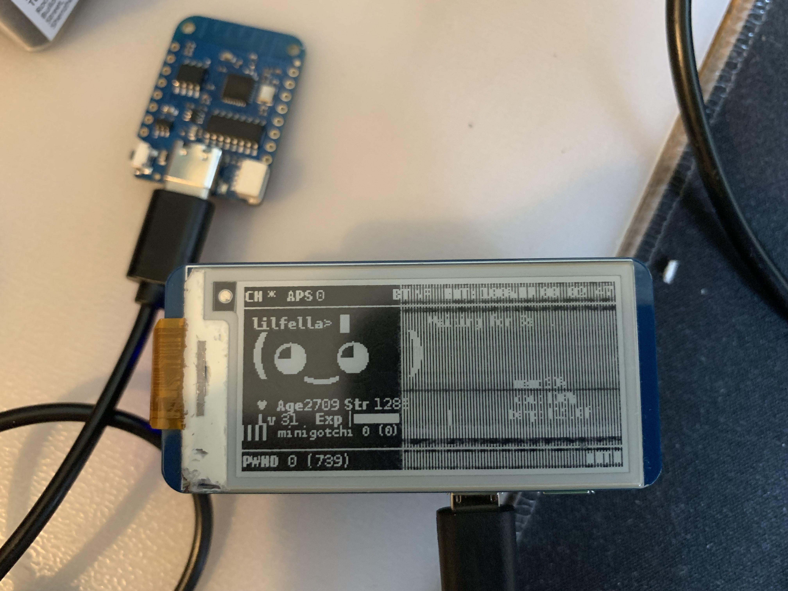

# minigotchi-wio-terminal - ミニゴッチ

</img>
</img>

</img>
</img>

## [Minigotchi](https://github.com/dj1ch/minigotchi) ported to the Wio Terminal

</img>

### Intro

This is the port of Minigotchi to the Wio terminal. Instead of being an ESP32 or ESP8266 sort of SoC, the Wio terminal uses a RTL8720 wifi card, which is... different, especially for a microcontroller. Due to a lack of libraries, support for specific features that the ESP has, there were many features that were stripped from this version.

A lot of the hardware APIs and functions aren't really shown or used often in projects involving this microcontroller, so I had to do a bit of digging. At least this is a prebuilt!

### Install guide

Not ready yet!

### Languages

The code is written in these languages.

- _C_
- _C++_

Note that the _C++_ in Arduino is slightly modified from what I have heard. See [this Reddit question](https://www.reddit.com/r/arduino/comments/x46sml/is_arduino_programming_language_c/) for more about this. Arduino probably has tweaked it to be more beginner-friendly, although still being [low-level](https://en.wikipedia.org/wiki/Low-level_programming_language). The _Pwnagotchi_ is a complex machine written in _Python_ and _Go_, so code from the Pwnagotchi Project is **not** compatible with mine.

### Prerequisites

- Arduino IDE
- A good understanding of coding/programming
- Wio Terminal
- A reliable and appropriate power source and supply for the hardware
- Patience (a lot of it)
- The ability to read

### How it operates/works

See the [wiki](https://github.com/dj1ch/minigotchi/wiki/How-the-Minigotchi-works).

### Hardware

See the [wiki](https://github.com/dj1ch/minigotchi/wiki/Hardware).

### To do

See this [project](https://github.com/orgs/dj1ch/projects/4).

### Contributing

See the Contributing Guidelines [here](CONTRIBUTING.md).

### FAQ

See the [wiki](https://github.com/dj1ch/minigotchi/wiki/FAQ).

### Communication

See the [wiki](https://github.com/dj1ch/minigotchi/wiki/Communication#communication).

### Last but not least... Some thank you's

**If you believe your project wasn't properly credited, please let me know ASAP! Here's how you can [communicate](https://github.com/dj1ch/minigotchi/wiki/Communication#communication) with me.**

**Thanks to these projects for making this a little bit more possible for me, I have used libraries/code from these projects and implemented it here:**

- [Pwngrid](https://github.com/evilsocket/pwngrid), this is what the project is trying to replicate, specifically the Pwnagotchi's system of peer detection. If this didn't exist, this project probably wouldn't have either.

- [RTL8720dn-WiFi-Packet-Injection](https://github.com/tesa-klebeband/RTL8720dn-WiFi-Packet-Injection), a showcase of Wio Terminal packet injection

- [HumiditySnifferRTL8720](https://github.com/FL0WL0W/HumiditySnifferRTL8720), a sniffer/humidity sensor project for the Wio Terminal

- [Arduino_GFX](https://github.com/moononournation/Arduino_GFX), The Adafruit_GFX library meant for the Wio Terminal.

**Made with ❤️ by [@dj1ch](https://github.com/dj1ch) and the rest of the Pwnagotchi-Unofficial team!**
